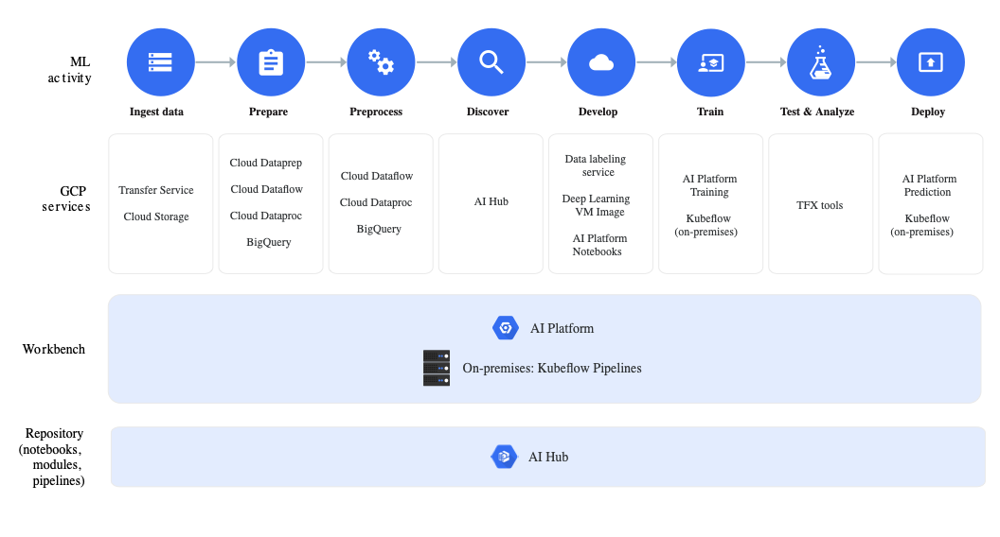
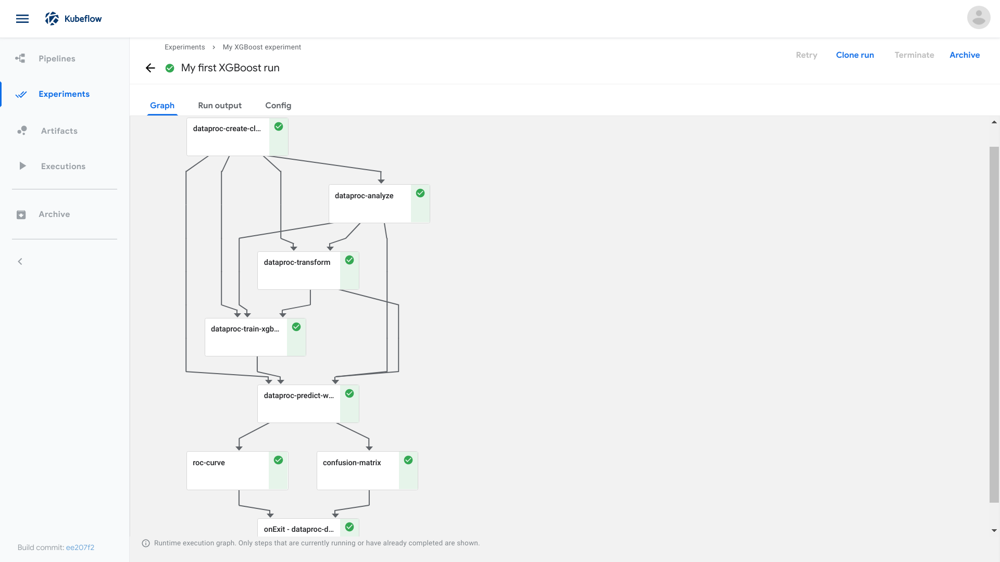

# Google Cloud AI Platform Pipelines

Often AI is being taught to users while using jupyter notebooks.
However, they do not take into consideration the needs to bring the AI
services into a production environment that deals with scalable services
exposed in the cloud.

One of the other issues using notebooks in for example data science
education is that students no longer use or understand a full program
design with classes and software engineering methods outside the
definition of functions, leading to solutions that do not go beyond
simple experiments. (after looking at this, it seems emphasize on
classes is reduced because we use functional programming and put them
together in pipelines. This is good for small projetcs but may still
lack the need to develop large software engineering-based complex
applications. What is here attempted is to get away with just high-level
functions and have others develop what is below these functions).

The google cloud AI platform pipeline will address some of these issues.

According to Google, "Cloud AI Platform Pipelines provides a way to
deploy robust, repeatable machine learning pipelines along with
monitoring, auditing, version tracking, and reproducibility, and
delivers an enterprise-ready, easy to install, secure execution
environment for your ML workflow" [1].

It is integrated into Googles Cloud Console allowing for easy
installation, and integration with Google services such as BigQuery [?],
Dataflow [?], AI Platform Training and services [?], cloud functions [?]
and more [?] [1].

Benefits include ease of installation through the Google cloud console.
This is an important feature as many data scientists no longer possess
the ability to download and install classical computer programs on their
computers (at least not at IU). The services are installed in a Google
Kubernetes Engine [?] that is automatically created if not available.
Furthermore, access can be enabled through authentication to team
members.

Vital is the multitude in access to it through 

* REST 
* [Pipeline SDK](https://cloud.google.com/ai-platform/pipelines/docs/connecting-with-sdk)
* [Notebooks](https://cloud.google.com/ai-platform-notebooks)

The Architecture image released by Google explains best how these
components fit together as part of the Google ecosystem (see
@fig:google-ai-pipeline-ecosystem).

{#fig:google-ai-pipeline-ecosystem}

## Kubeflow

The Google AI Pipeline is tightly integrated with Kubeflow [2].

The important part to note is that Kubeflow provides a convenient
mechanism to create from python functions pipelined objects that can be
weaved together in python. As they are available in python, they can
naturally be integrated into jupyter notebooks. Kubeflow does assume the
availability of a Kubernetes cluster, which allows the use of Kubeflow,
on any cloud provider, including AWS, Azure, and others. What Google AI
Platform provides is the ability to leverage Google as provider witch
easy to generate backend infrastructure. The other point to make here is
that as we do run in the Google infrastructure, other google services
can easily be integrated.

Kubeflow, via Google, has also started to put together an AI Hub, in
which pipeline templates can be stored, downloaded, and reused by others.

* <https://aihub.cloud.google.com/u/0/s?category=pipeline>

At the time of writing, there were 640 AI pipelines available in the AI
Hub. We have not analyzed these pipelines on usability or applicability.
The publishers include

Status March 15, 2020

Number | Publisher
------ | ---------
3 | Intel
60 | Google
1 | Pluto 7
0 | NVIDIA
0 | DeepMind

One of the convenient features in Kubeflow is that in addition to being
able to set up the workflows in Jupyter notebooks allowing a programming
style promoting literate programming. It includes a runtime flow
visualization that comes in handy for time-consuming jobs.

A screenshot copied from [3] is includes in @fig:kubeflow-graph.

## References

[1] <https://cloud.google.com/blog/products/ai-machine-learning/introducing-cloud-ai-platform-pipelines>

[2] <https://www.kubeflow.org/>

[3] <https://www.kubeflow.org/docs/pipelines/pipelines-quickstart/>
