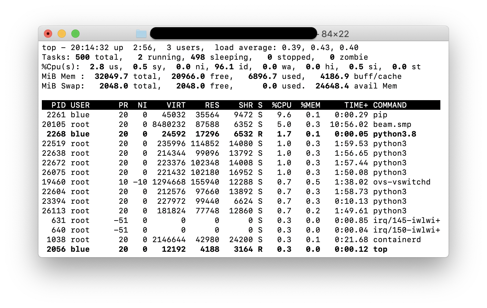
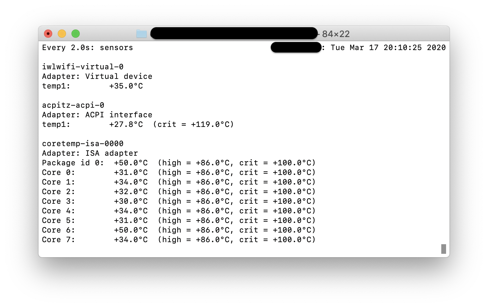
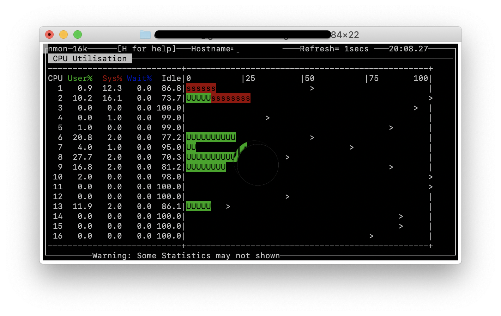

# Ubuntu Setup

Prerequisit Ubuntu 19.10, it will likely work also with 18.04

Note this is an experimental Ubuntu setup on a vanilla 
Ubuntu machine. Although we have not tried this, this also 
works in a docker container (excluding graphics programs and 
installs. If you use a container you must have at least 2GB 
memory for it. If you do not have this you can set an Ubuntu VM 
up in a cloud. 

## Ip Address

``` bash
ip address show
```


## Update ubuntu

``` bash
sudo apt update && sudo apt upgrade -y
```

## System Hardware (general)

``` bash
$ sudo apt-get install -y hwinfo
$ hwinfo
$ free -m
$ vmstat -s
```

## System Hardware (Specific)

Do not execute, this is syetem specific if you have an NVIDIA card in
the computer.

``` bash
$ apt search nvidia-driver*
$ ubuntu-drivers devices
$ sudo ubuntu-drivers autoinstall
```

For an RTX2060 this can be done alternatively

``` bash
$ ubuntu-drivers devices
$ sudo apt install nvidia-driver-435
```

## Git

``` bash
$ sudo apt-get install git
```

## SSH Server

``` bash
$ sudo apt install openssh-server
$ sudo systemctl status ssh
$ ssh-keygen
```

### Some convenient SSH management commands

Not used was it seems to be on by default

``` bash
$ sudo ufw allow ssh
```

If you need to Stop ssh

``` bash
$ sudo systemctl start ssh
```

If you need to Start ssh

``` bash
$ sudo systemctl stop ssh
```

If you need to disable it (after a boot)

``` bash
$ sudo systemctl disable ssh
```

If you need to enable is (after a boot)

``` bash
$ sudo systemctl enable ssh
```

## LaTex 

``` bash
$ sudo apt-get install texlive-full
```

## Emacs

On Ubuntu you have `gedit`, put if you like to install 
emacs, please use.

``` bash
sudo apt install emacs
```

## Python

``` bash
$ sudo apt-get install build-essential checkinstall
$ sudo apt-get install libreadline-gplv2-dev libncursesw5-dev libssl-dev     libsqlite3-dev tk-dev libgdbm-dev libc6-dev libbz2-dev libffi-dev zlib1g-dev
$ mkdir /opt
$ cd /opt
$ sudo wget https://www.python.org/ftp/python/3.8.2/Python-3.8.2.tgz
$ sudo tar xzf Python-3.8.2.tgz
$ cd Python-3.8.2
$ sudo ./configure --enable-optimizations
$ sudo make altinstall
$ sudo rm Python-3.8.2.tgz
$ python3.8 -m venv ~/ENV3
$ source ~/ENV3/bin/activate
$ pip install pip -U 
```

## Cloudmeh

You must remmeber to have an ssh key generated.

``` bash
$ pip install cloudmesh-installer
$ time cloudmesh-installer get openstack
$ cms help
$ cms gui quick
$ cms init
```

## Cloudmesh and Chameleon cloud

1. We assume you do not have any keys on chameleoncloud. 
   If you do, please delete them. IN general you will not.
2. We assume that you have successfully logged into chameleon 
   cloud and used Horizon.
3. We assume you use and remember your chameleon cloud 
   password in `cms gui quick` that is the same username and 
   password from your `chameleon.org` dashboard
   
``` bash
$ cms key upload --cloud=chameleon
```   

Now you can use chameleon

``` bash
$ cms vm list --refresh
$ cms flavor list --refresh
$ cms image list --refresh
```

## VNC (Optional)

If you need to connect to this ubuntu via a remote app from another
computer and need the Desktop

Opion A: tightvnc

``` bash
sudo apt install tightvncserver
```

``` bash
sudo apt install tigervnc-standalone-server tigervnc-common
```

Using it. start 

``` bash
vncserver
```

Use 

```
ssh -L 5901:127.0.0.1:5901 -N -f -l username hostname
```

Then in real vnc, esablish a connection to

`localhost:5901`


## OpenStack

The instruction on their Web Page does not work

``` bash
$ sudo snap install microstack --classic --edge
$ sudo microstack.init --auto
```

Instead try 

```bash
$  sudo snap refresh microstack --devmode --edge
$ sudo microstack.init --auto
```

Now go to you web browser and type in 

10.20.20.1

username: admin
password: keystone

Chnage your password in horizon

Now you have your own openstack on your computer. However we have not 
done any configuration. For the class we recommend to use chameleon 
cloud as everything is set up there.


## Docker

``` bash
sudo apt-get remove docker docker-engine docker.io containerd runc
sudo apt-get update
sudo apt-get install \
    apt-transport-https \
    ca-certificates \
    curl \
    gnupg-agent \
    software-properties-common
curl -fsSL https://download.docker.com/linux/ubuntu/gpg | sudo apt-key add -
sudo add-apt-repository \
   "deb [arch=amd64] https://download.docker.com/linux/ubuntu \
   $(lsb_release -cs) \
   stable"
sudo apt-get install docker-ce docker-ce-cli containerd.io
sudo docker run hello-world
```

## Monitoring

Here we introduce you to some commanlins sensor tools for Linux

Some additional tools can be found here:

* <https://linoxide.com/monitoring-2/10-tools-monitor-cpu-performance-usage-linux-command-line/>

### Top

```bash
$ top
```




### Temperature Sensors

```bash
sudo apt install lm-sensors hddtemp
sudo sensors-detect
sudo /etc/init.d/kmod start
sensors
```

Continious watching 

``` bash
watch -n 1 sensors
```





### NMon

``` bash
sudo apt-get install nmon
nmon
```




